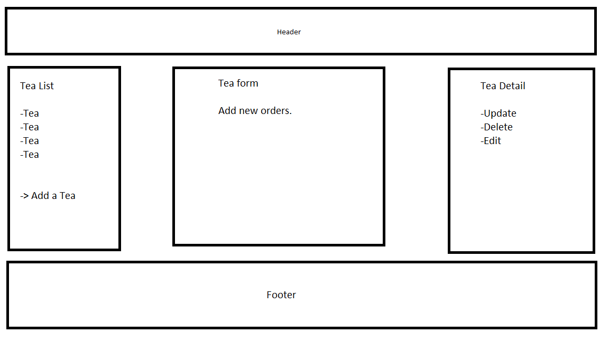

# Uncle Iroh's Tea House

#### _By_ _Alesandria Wild_

## **Technologies Used**


- JavaScript
- React
- Visual Studio Code
- GitHub
- HTML
- CSS
- MDN Documents
- Dillinger.io
- learhowtoprogram.com
- Command Line

## **Description**

A React web application that tracks the stores inventory.

## Component Diagram



## Setup/Installation Requirements

1. Clone this project to your local machine using the following command:

```
git clone https://github.com/ThatAltGirlAlesandria/tea-house.git
```

2. Open your shell and navigate to this project's production directory named `tea-shop`.
3. Run the command `npm install` to install all Node packages and dependencies.
4. run the command `npm run start` to bundle and begin running the project. The app will automatically open in your browser.

## Available Scripts

In the project directory, you can run:

### `npm start`

Runs the app in the development mode.\
Open [http://localhost:3000](http://localhost:3000) to view it in your browser.

The page will reload when you make changes.\
You may also see any lint errors in the console.

### `npm test`

Launches the test runner in the interactive watch mode.\
See the section about [running tests](https://facebook.github.io/create-react-app/docs/running-tests) for more information.

### `npm run build`

Builds the app for production to the `build` folder.\
It correctly bundles React in production mode and optimizes the build for the best performance.

The build is minified and the filenames include the hashes.\
Your app is ready to be deployed!

See the section about [deployment](https://facebook.github.io/create-react-app/docs/deployment) for more information.

## **Known Bugs**

- Not building currently

## License

MIT Copyright 2023 Alesandria Wild

